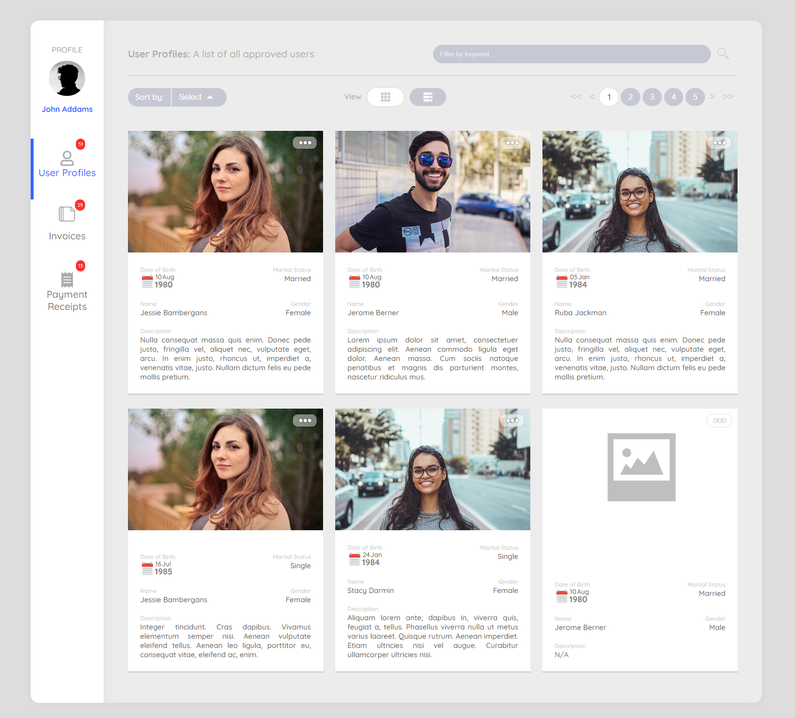

# Getting Started

## DashboardJS

\
[DashboardJS](https://www.dashboardjs.net) (www.dashboardjs.net) is a free, modular, responsive, open source Dashboard / Record List component to display records in a sleek and modern way, built entirely in vanilla Js, with zero dependancies. You can have different tabs that show different recordsets complete with pagination, sorting, filtering, and you can switch views for each recordset between Card view, and List view.

<figure><figcaption><p>DashboardJS in Card View Mode</p></figcaption></figure>

DashboardJS is fully themeable, all you need is knowledge of HTML & CSS.

DashboardJS works either Synchronously (full data loaded and fed into the Dashboard component before initiation), or Asnychronously (Dashboard loads page by page through Fetch API).

Download: [DashboardJS.zip](../dist/DashboardJS.zip)\
Website:[ https://www.dashboardjs.net](https://www.dashboardjs.net)

### Setting up

This is the basic HTML to load the dashboard

```html
<!DOCTYPE html>
<html xmlns="http://www.w3.org/1999/xhtml">
	<head>
		<title>My Dashboard</title>
		<meta http-equiv="Content-Type" content="text/html; charset=utf-8" />
		<meta name="viewport" content="width=device-width, initial-scale=1.0, maximum-scale=1.0, user-scalable=0">
		<link rel="stylesheet" href="./dashboardjs/css/rules.css">		
		<link rel="stylesheet" href="./dashboardjs/css/theme.css">		
		<script src="./dashboardjs/js/dashboard-all.js"></script>	
		<script>	
		</script> 
	</head>
	<body>	
		<div class="dashboard-container">
			
		</div>
		<script src="./dashboardjs/js/load-dashboard.js"></script>	
	</body>	
</html>
```

### Simplest Example:

```
load-dashboard.js:
```

```javascript
var dashboard = new FutureLabs.Dashboard({
  data: [{
      "Name": "Jessie Bambergans",
      "Status": "Married",
      "Date": "1980-08-10",
      "Gender": "Female"
    },{
      "Name": "Jerome Berner",
      "Status": "Single",
      "Date": "1980-08-10",
      "Gender": "Male"
    },{
      "Name": "Ruba Jackman",
      "Status": "Married",
      "Date": "1984-01-05",
      "Gender": "Female"
  }],
  templateURL: './dashboardjs/dashboard.html',
  appendTo: document.querySelector(".dashboard-container")
});
```

### Example with customization options for the tabs, fields & actions:

```javascript
var dashboard = new FutureLabs.Dashboard({
  // The Dashboard Language (will use the translation objects in each config property to translate)
  // 'en-US' is the default langauge when the language property is ommitted
  language: "en-US",
  config: {
    profile: {
      name: "John Addams",
      translation: {
        "ar-AE": "عبد الله المستكاوي",
      },
      image: "dashboardjs/assets/jadams.jpg",
      url: "https://www.google.com",
      urlTarget: "_blank",
    },
    initialActiveTab: "User Profiles",
    tabs: {
      "User Profiles": {
        // translations for multilingual support
        // This works for all config objects: tabs, fields, actions, ...etc
        // Simply add the translations and pair them up to the language code that is passed to the dashboard in the config object
        translation: {
          "ar-AE": "ملفات تعريف المستخدم",
        },
        // The class name for the tab icon. You can use custom class names (add them to theme.css), or if you include the fontawesome library
        // you can just use the icon classname from fontawesome (Supports fontawesome)
        icon: "far fa-user",
        // A brief description that will appear on top of each tab
        // Can be just a string when multilanguage support is not needed
        // Alternatively, can be an object with language keys as below for multilingual support
        description: {
          "en-US": "A list of all approved users",
          "ar-AE": "قائمة بجميع المستخدمين المعتمدين",
        },
        // Sets the default view mode for this tab: Cards view or List view
        viewMode: "Cards", // 'Cards' or 'List'
        // CSS GRID property/value pairs to format the records in Cards view.
        // Below is the default css properties, can be changed to any valid CSS proeprty/value pairs
        recordsGrid: {
          "grid-template-columns": "1fr 1fr 1fr",
          gap: "20px",
          "justify-items": "stretch",
        },
        // Pagination. Define how many records per page.
        // Defaults to 12!
        itemsPerPage: 12,
        recordSettings: {
          // Renders an image for each record
          image: {
            url: "imageURL", // this is the key that is used to retrieve the URL from the supplied data
            height: "200px", // Height of the image in Card View
          },
          // On Click event for the entire record
          onClick: function (record) {
            alert("Record Clicked: record: " + JSON.stringify(record.data));
          },
          fieldsGrid: {
            "grid-template-columns": "1fr 1fr",
            gap: "15px",
            "justify-items": "stretch",
          },
          fields: {
            // This is a collcation of value/key pair of objects describing the record fields
            // Each key maps to the key of the supplied data to retrieve the value of each field
            Date: {
              // This key name maps to the data
              name: "Date of Birth", // Displayed Name of the field int he dashboard
              position: "left", // Position in the Card View
              dataType: "Date", // This just formats and renders the date in a graphical way
              translation: { "ar-AE": "السن" },
            },
            Status: {
              name: "Marital Status",
              position: "right",
              dataType: "String", // Does nothing at the moment
              // Can use this to modify the data value before displaying it to the dashboard
              onGetValue: function (field) {
                if (
                  field.data == "Married" &&
                  field.record["Gender"] == "Female"
                ) {
                  return (
                    '<span style="font-weight: bold;color: #72de72">' +
                    field.data +
                    "</span>"
                  );
                } else {
                  return field.data;
                }
              },
              translation: { "ar-AE": "الحالة الزوجية" },
            },
            Name: {
              name: "Name",
              position: "left", // Position in the Card View
              // This controls the visibility of the field.
              // Accepts 3 values: show, hide, disable
              visibility: function (field) {
                // Checks to see if the name of this person contains the phrase (disabled) in the name, then disable this field
                // disable greys out the field and removes all actions on the field (including onClick)
                if (field.data.indexOf("(disabled)") > -1) {
                  return "disable";
                } else {
                  return "show";
                }
              },
              onClick: function (element, record) {
                console.log("Field Clicked: element, data:", element, record);
              },
              translation: { "ar-AE": "الإسم" },
            },
            Gender: {
              name: "Gender",
              position: "right", // Position in the Card View
              dataType: "String",
              translation: { "ar-AE": "الجنس" },
            },
            Description: {
              position: "left",
              width: "400px",
              style: {
                "grid-column": "span 2",
              },
              class: "justify",
              onGetValue: function (item) {
                // If there is no value
                if (!item.data) {
                  return '<span style="color: #c3c3c3">N/A</span>';
                }
              },
              translation: { "ar-AE": "الوصف" },
            },
          },
          // How should the actions appear?
          // 'buttons' (default) displays the actions as buttons
          // 'menu' shows the action as a drop down menu
          actionsType: "menu",
          actions: {
            "More details...": {
              icon: "info-icon",
              translation: {
                "ar-AE": "معلومات أخرى",
              },
              onClick: function (action) {
                alert(
                  "Clicked More Info ... on record " +
                    JSON.stringify(action.record)
                );
              },
            },
            Pay: {
              icon: "pay-icon",
              translation: {
                "ar-AE": "دفع",
              },
              visibility: function (actionObj) {
                // returns a string representing the visibility
                return "disable";
              },
              onClick: function () {
                alert("Clicked Pay!");
              },
            },
            Edit: {
              icon: "edit-icon",
              translation: {
                "ar-AE": "تعديل",
              },
              onClick: function () {
                alert("Clicked Edit");
              },
            },
            Cancel: {
              icon: "cancel-icon",
              translation: {
                "ar-AE": "إلغاء",
              },
              onClick: function () {
                alert("Clicked Cancel");
              },
            },
          },
        },
      },
      Invoices: {
        description: "This shows all invoices",
        viewMode: "Cards",
        recordsGrid: {
          "grid-template-columns": "1fr 1fr 1fr",
          gap: "20px",
          "justify-items": "stretch",
        },
        recordSettings: {
          onClick: function (record) {
            alert("Record Clicked: record: " + JSON.stringify(record.data));
          },
          fieldsGrid: {
            "grid-template-columns": "1fr 1fr 1fr",
            gap: "15px",
            "justify-items": "stretch",
          },
          fields: {
            Name: {
              style: {
                "grid-column": "span 2",
              },
              translation: { "ar-AE": "الإسم" },
              icon: "fas fa-user-circle", // You can use Fontawesome icon classes if you include the fontawesome library
              onClick: function (field) {
                console.log("Field Clicked! field:", field);
              },
            },
            Balance: {
              style: {
                "grid-column": "span 1",
              },
              position: "right",
              icon: "fas fa-money-bill-wave", // You can use Fontawesome icon classes if you include the fontawesome library
              onGetValue: function (field, record) {
                debugger;
                if (field.data) {
                  return "$" + field.data;
                }
              },
              translation: { "ar-AE": "الحساب" },
            },
            Date: {
              name: "Date of Birth",
              position: "left",
              dataType: "Date",
              translation: { "ar-AE": "السن" },
            },
            Status: {
              name: "Marital Status",
              translation: { "ar-AE": "خد كثير" },
            },
            Gender: {
              name: "Gender",
              position: "right",
              dataType: "Text",
              translation: { "ar-AE": "السن" },
            },
            Description: {
              position: "left",
              style: {
                "grid-column": "span 3",
              },
              class: "justify",
              width: "200px",
              onGetValue: function (item) {
                // If there is no value
                if (!item.data) {
                  return '<span style="color: gray">N/A</span>';
                }
              },
            },
          },
          actionsType: "buttons", // menu or buttons
          actions: {
            "More details...": {
              icon: "info-icon",
              translation: {
                "ar-AE": "معلومات أخرى",
              },
              onClick: function () {
                alert("Clicked More Info ...");
              },
            }, // Default View action Will appear
            Pay: {
              icon: "pay-icon",
              translation: {
                "ar-AE": "دفع",
              },
              visibility: function (actionObj) {
                // returns a string representing the visibility
                return "disable";
              },
              onClick: function () {
                alert("Clicked Pay!");
              },
            },
            Edit: {
              icon: "edit-icon",
              translation: {
                "ar-AE": "تعديل",
              },
              onClick: function () {
                alert("Clicked Edit");
              },
            },
            Cancel: {
              icon: "cancel-icon",
              translation: {
                "ar-AE": "إلغاء",
              },
              onClick: function () {
                alert("Clicked Cancel");
              },
            },
          },
        },
      },
      "Payment Receipts": {
        icon: "fas fa-receipt",
        description: "Payment Receipts",
        viewMode: "list",
        recordsGrid: {
          "grid-template-columns": "1fr 1fr 1fr",
          gap: "20px",
          "justify-items": "stretch",
        },
        recordSettings: {
          image: {
            url: "imageURL",
            height: "200px",
          },
          onClick: function (record) {
            alert("Record Clicked: record:", record);
          },
          fieldsGrid: {
            "grid-template-columns": "1fr 1fr",
            gap: "15px",
            "justify-items": "stretch",
          },
          fields: {
            Date: {
              name: "Date of Payment",
              position: "left",
              dataType: "Date",
              translation: { "ar-AE": "السن" },
            },
            Status: {
              name: "Marital Status",
              position: "right",
              dataType: "Number",
              translation: { "ar-AE": "خد كثير" },
            },
            Name: {
              name: "Name",
              position: "left",
              translation: { "ar-AE": "الإسم" },
              onClick: function (element, record) {
                console.log("Field Clicked: element, data:", element, record);
              },
            },
            Payment: {
              name: "Payment",
              position: "right",
              dataType: "Number",
              translation: { "ar-AE": "الدفع" },
            },
          },
        },
      },
    },
  },
  data: data,
  templateURL: "dashboardjs/dashboard.html",
  appendTo: ".dashboard-container",
});
```
