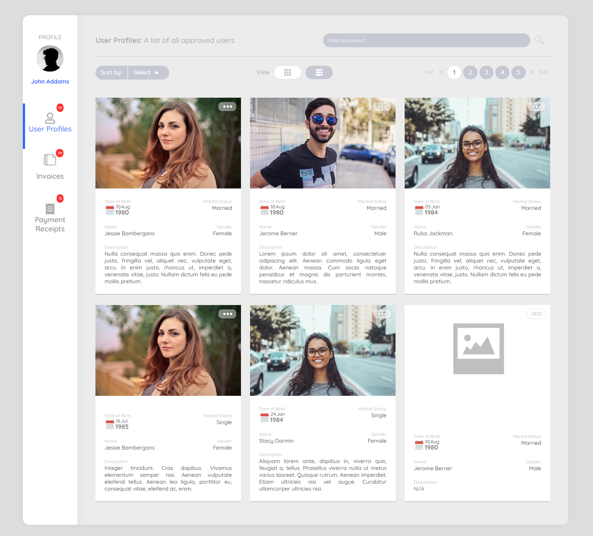

# Getting Started

## DashboardJS

\
[DashboardJS](https://www.dashboardjs.net) (www.dashboardjs.net) is a free, modular, responsive, open source Dashboard / Record List component to display records in a sleek and modern way, built entirely in vanilla Js, with zero dependancies. You can have different tabs that show different recordsets complete with pagination, sorting, filtering, and you can switch views for each recordset between Card view, and List view, and each record, field and action come with a multitude of events that you can hook onto to process data and change behaviour.

<figure><figcaption><p>DashboardJS in Card View Mode</p></figcaption></figure>

DashboardJS is fully themeable, all you need is knowledge of HTML & CSS.

DashboardJS works either Synchronously (full data loaded and fed into the Dashboard component before initiation), or Asnychronously (Dashboard loads page by page through Fetch API).

Download: [DashboardJS.zip](../dist/DashboardJS.zip)\
Website:[ https://www.dashboardjs.net](https://www.dashboardjs.net)

### Setting up

This is the basic HTML to load the dashboard

```html
<!DOCTYPE html>
<html xmlns="http://www.w3.org/1999/xhtml">
	<head>
		<title>My Dashboard</title>
		<meta http-equiv="Content-Type" content="text/html; charset=utf-8" />
		<meta name="viewport" content="width=device-width, initial-scale=1.0, maximum-scale=1.0, user-scalable=0">
		<link rel="stylesheet" href="./dashboardjs/css/rules.css">		
		<link rel="stylesheet" href="./dashboardjs/css/theme.css">		
		<script src="./dashboardjs/js/dashboard-all.js"></script>	
		<script>	
		</script> 
	</head>
	<body>	
		<div class="dashboard-container">
			
		</div>
		<script src="./dashboardjs/js/load-dashboard.js"></script>	
	</body>	
</html>
```

### Simplest Example:

```
load-dashboard.js:
```

```javascript
var dashboard = new FutureLabs.Dashboard({
  data: [{
      "Name": "Jessie Bambergans",
      "Status": "Married",
      "Date": "1980-08-10",
      "Gender": "Female"
    },{
      "Name": "Jerome Berner",
      "Status": "Single",
      "Date": "1980-08-10",
      "Gender": "Male"
    },{
      "Name": "Ruba Jackman",
      "Status": "Married",
      "Date": "1984-01-05",
      "Gender": "Female"
  }],
  templateURL: './dashboardjs/dashboard.html',
  appendTo: document.querySelector(".dashboard-container")
});
```

### Adding tabs, fields and actions

Everything past the raw data is optional. Add `config` when you want to rename a
field, change how a value is displayed, or attach behaviour.

```javascript
var dashboard = new FutureLabs.Dashboard({
  config: {
    tabs: {
      'User Profiles': {
        icon: 'far fa-user',
        description: 'A list of all approved users',
        viewMode: 'Cards',              // 'Cards' or 'List'
        itemsPerPage: 12,

        recordSettings: {
          image: { url: 'imageURL', height: '200px' },

          fields: {
            Date:   { name: 'Date of Birth', dataType: 'Date', width: '100px' },
            Name:   { name: 'Name', position: 'left' },
            Status: {
              name: 'Marital Status',
              position: 'right',
              // Whatever you return here is displayed. HTML is allowed.
              value: ({ value, record }) =>
                record.Gender === 'Female' && value === 'Married'
                  ? '<b style="color:#72de72">' + value + '</b>'
                  : value
            },
            Gender: {
              name: 'Gender',
              position: 'right',
              icon: ({ value }) => value === 'Female' ? 'fas fa-venus' : 'fas fa-mars'
            }
          },

          actionsType: 'menu',          // 'buttons' (default) or 'menu'
          actions: {
            'More details...': { icon: 'info-icon', onClick: ({ record }) => showDetails(record) },
            'Pay': {
              icon: 'pay-icon',
              // 'disable' greys the button out rather than removing it
              visibility: ({ record }) => record.Balance > 0 ? 'show' : 'disable',
              onClick: ({ record }) => startPayment(record.InvoiceId)
            },
            'Delete': {
              icon: 'cancel-icon',
              // Nothing is removed unless this returns something other than false
              onBeforeRemove: ({ record }) => confirm('Remove ' + record.Name + '?')
            }
          }
        }
      }
    }
  },
  data: data,
  templateURL: 'dashboardjs/dashboard.html',
  appendTo: '.dashboard-container'
});
```

### Where to go next

The config object nests the same way the UI does:

| Page | Covers |
| --- | --- |
| [Config](configuration-options/config/README.md) | Top-level options, profile, and a full two-tab example |
| [Tabs](configuration-options/tabs.md) | One entry per recordset — icon, description, view mode, paging |
| [Record Settings](configuration-options/record-settings.md) | Images, field layout, and record-level events |
| [Fields](configuration-options/fields.md) | Columns — naming, formatting, linking, visibility |
| [Actions](configuration-options/actions.md) | Per-record buttons and menus |
| [Callbacks](configuration-options/callbacks.md) | How every function in the config is called |

Any of `value`, `icon`, `url`, `visibility`, `class`, `style` and `width` may be a
function instead of a static value, and every component accepts `onClick`,
`onRender`, `onMount` and `onBeforeRemove`. Every one of them receives a single
context object — destructure the keys you need:

```javascript
value:   ({ value, record }) => record.Gender === 'Female' ? value.toUpperCase() : value,
onClick: ({ record, event }) => { event.stopPropagation(); open(record.Id); }
```

See [Callbacks](configuration-options/callbacks.md) for every context key and
what each hook returns.
